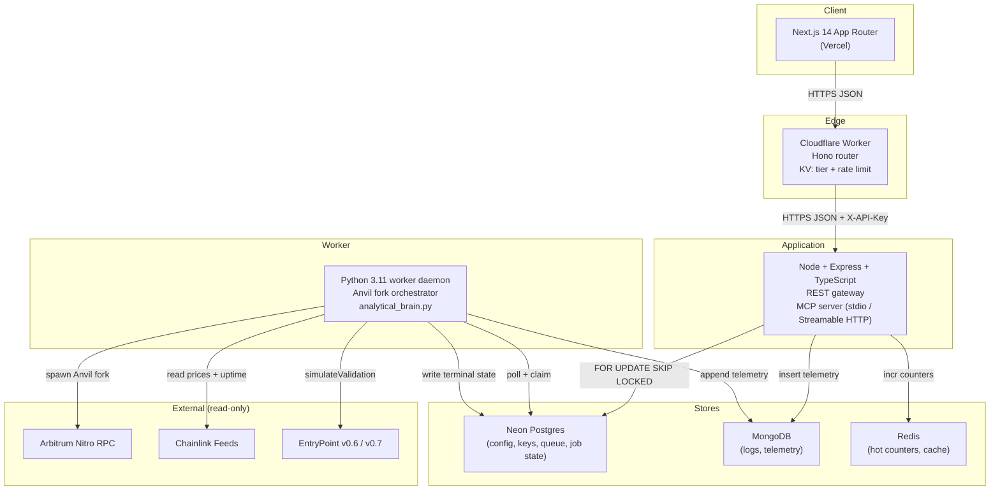

# ArbiSim Guard

> Pre-flight simulation layer for AI agents on Arbitrum. Simulate every transaction in an ephemeral fork before it touches mainnet.

**Live demo:** [arbisimguard.vercel.app/dashboard/simulate](https://arbisimguard.vercel.app/dashboard/simulate)

## What is ArbiSim Guard?

ArbiSim Guard is the only pre-flight simulation API built for autonomous AI agents on Arbitrum. Instead of analyzing transactions after they settle (and the money is already gone), ArbiSim Guard simulates them first in a block-accurate, ephemeral Arbitrum fork. Agents catch reverts, slippage blowouts, MEV exposure, and gas surprises while they are still free to fix.

**The problem:** AI agents executing DeFi strategies submit live transactions and hope for the best. Existing tools like Tenderly are built for human developers. Post-execution monitors (VetoVault, Himaya Agent, bond.credit Watchtower) tell you what went wrong after the loss. None of them prevent it.

**The solution:** Send a transaction payload or ERC-4337 UserOperation to ArbiSim Guard. We spin up a fresh Arbitrum fork, execute it exactly as the chain would, and return an APPROVED or REJECTED verdict with full telemetry before you send a single wei.

## How It Works

```
Agent decides to execute a swap
  |
  v
POST /api/v1/simulate  (or MCP: preflight_simulate)
  |
  v
ArbiSim Guard spins up an ephemeral Anvil fork (block-pinned to current head)
  |
  v
Transaction executes inside the fork using wallet impersonation
  |
  v
Python analytical engine parses traces, gas, slippage, MEV risk
  |
  v
Returns APPROVED or REJECTED with structured telemetry
```

## Architecture

ArbiSim Guard is a 4-tier system: edge gateway, application server, worker daemon, and data stores.



### Request Lifecycle

```
POST /api/v1/simulate
    |
    +-- Cloudflare Worker: auth via X-API-Key, KV tier/limit lookup
    |
    +-- Node gateway: validate body, assign job_id, enqueue
    |
    +-- Return 202 Accepted { session_id, status: "PENDING" }
    |
    +-- Python worker claims job (FOR UPDATE SKIP LOCKED)
    |   +-- Spawn ephemeral Anvil fork at block.head
    |   +-- Execute tx/UserOp via wallet impersonation
    |   +-- Run analytical_brain.py (gas, slippage, MEV, Stylus)
    |   +-- Write terminal APPROVED/REJECTED + telemetry
    |
    +-- Client polls GET /api/v1/simulate/{session_id}
         Returns full simulation receipt when terminal
```

### Trust Boundaries

- API key validated at the Cloudflare edge (KV lookup) and at the Node gateway (Argon2id hash check)
- Untrusted calldata enters only inside the ephemeral Anvil fork (process-isolated, no mainnet keys, torn down after each job)
- The fork has no outbound network except Arbitrum RPC and Chainlink feeds

## Safety Flags

Every simulation returns a structured flag object. Each flag is an independent check:

| Flag | Description |
|---|---|
| `execution_reverted` | Transaction would revert on-chain and burn gas |
| `high_slippage` | Price impact exceeds the configured threshold |
| `sandwich_detected` | Adversarial ordering risk from surrounding transactions |
| `unsafe_allowance` | Token approval exceeds the transaction amount |
| `sig_failed` | ERC-4337 UserOp signature validation failed |
| `valid_until_expired` | Session key or UserOp has expired |
| `timeboost_recommended` | Priority lane would secure 200ms advantage |
| `stylus_ink_overflow` | WASM execution exceeds ink budget |

If any dangerous flag fires, the verdict is REJECTED. The agent aborts. No mainnet transaction fires. No capital lost.

## Arbitrum-Native Technical Depth

This is not a generic EVM simulator. ArbiSim Guard implements Arbitrum Nitro internals:

**L1 Calldata Buffer:** Calldata is compressed with brotli-zero (ArbOS's exact variant, compression level 0), multiplied by 16 (Ethereum's gas-per-non-zero-byte), and divided by the live L2 base fee. This matches ArbOS's own cost function.

**Stylus WASM Detection:** Contracts are checked for the `0xEFF00000` bytecode prefix. For Stylus contracts, the engine applies the 1:10,000 EVM-gas-to-Ink conversion ratio and the 0.84-gas host I/O penalty per Stylus's execution model.

**ERC-4337 Account Abstraction:** Full UserOperation simulation via EntryPoint v0.6 (`0x5FF137D4b0FDCD49DcA30c7CF57E578a026d2789`) and v0.7 (`0x0000000071727De22E5E9d8BAf0edAc6f37da032`). Validates signatures, session key expiration, and FailedOp revert reasons.

**P&L Calculation:** Net USD P&L from ERC-20 Transfer event traces combined with live Chainlink price feeds (ETH/USD: `0x639Fe6ab55C921f74e7fac1ee960C0B6293ba612` on Arbitrum), minus gas cost in USD.

## MCP Integration

ArbiSim Guard exposes `preflight_simulate` as a native MCP tool via `@modelcontextprotocol/sdk`. Any Vibekit, Eliza, or LangGraph agent can call it without custom SDK work.

```json
{
  "mcpServers": {
    "arbisim-guard": {
      "command": "node",
      "args": ["./gateway/dist/index.js", "--mcp"],
      "env": {
        "GATEWAY_API_KEY": "ask_free_xxxx"
      }
    }
  }
}
```

Tool annotations: `readOnlyHint: true`, `destructiveHint: false`, `idempotentHint: true`. Supports stdio (local dev) and Streamable HTTP (production).

## Quickstart

### Prerequisites

- Node.js 18+
- Python 3.11+
- Foundry (for Anvil)
- PostgreSQL (or Neon free tier)
- MongoDB (or Atlas free tier)

### 1. Clone and install

```bash
git clone https://github.com/CoderRahul01/ArbiSim.git
cd ArbiSim
cp .env.example .env
# Fill in your RPC URLs, database credentials, and API keys
```

### 2. Install dependencies

```bash
# Gateway (Node/TypeScript)
cd gateway && npm install && npm run build && cd ..

# Frontend (Next.js)
cd frontend && npm install && cd ..

# Worker (Python)
cd workers && pip install -r requirements.txt && cd ..
```

### 3. Start the Anvil fork

```bash
anvil --fork-url https://arb1.arbitrum.io/rpc --port 8545
```

### 4. Start the gateway

```bash
cd gateway && npm run dev
```

### 5. Start the frontend

```bash
cd frontend && npm run dev
```

### 6. Run your first simulation

```bash
curl -X POST http://localhost:3001/api/v1/simulate \
  -H "Content-Type: application/json" \
  -H "X-API-Key: YOUR_API_KEY" \
  -d '{
    "network": "arbitrum-one",
    "agent_address": "0x0000000000000000000000000000000000000001",
    "transactions": [
      {
        "to": "0x82aF49447D8a07e3bd95BD0d56f352415231aa11",
        "data": "0x",
        "value": "1000000000000000"
      }
    ],
    "max_slippage_tolerance": 2.0
  }'
```

Poll the result:

```bash
curl http://localhost:3001/api/v1/simulate/{session_id} \
  -H "X-API-Key: YOUR_API_KEY"
```

See the [full quickstart guide](./docs/quickstart.md) for REST and MCP examples.

## Tech Stack

| Layer | Technology |
|---|---|
| Frontend | Next.js 14 App Router, Tailwind CSS, Fraunces + Inter + JetBrains Mono |
| Edge Gateway | Cloudflare Workers, Hono, KV |
| Application | Node.js 18, TypeScript, Express, MCP SDK |
| Worker | Python 3.11, web3.py, Brotli |
| Fork Engine | Foundry / Anvil |
| Databases | Neon PostgreSQL, MongoDB Atlas, Redis (Upstash) |
| Chain | viem, ethers.js, Chainlink Data Feeds |
| AA | ZeroDev EntryPoint v0.6 + v0.7 |
| Deployment | Vercel (frontend), Cloudflare (edge), Fly.io / Railway (gateway + worker) |

## Repo Layout

```
ArbiSim/
  frontend/        Next.js App Router dashboard (Vercel)
  cloudflare/      Edge Worker (auth, KV rate-limit, tier lookup)
  gateway/         Node + Express REST + MCP server
  workers/         Python 3.11 worker daemon (Anvil fork orchestrator)
  contracts/       SimulationRegistry.sol (Arbitrum Sepolia)
  script/          Foundry deploy script
  docs/
    architecture/  HLD, LLD, request lifecycle (C4 + Mermaid)
    api/           OpenAPI 3.1 spec
    mcp/           preflight_simulate tool contract
    errors.md      RFC 9457 error catalog
    quickstart.md  5-minute developer guide
  demo_agent.ts    Example agent integration
  test_simulation.py        Phase 1 test (EOA simulation)
  test_userop_simulation.py Phase 2 test (ERC-4337 UserOp)
```

## Documentation

| Document | Description |
|---|---|
| [HLD](./docs/architecture/hld.md) | C4 Context + Container, deployment topology, trust boundaries, scaling model |
| [LLD](./docs/architecture/lld.md) | Data model, queue state machine, idempotency, rate limits, auth flow |
| [Request Lifecycle](./docs/architecture/request-lifecycle.md) | Sequence diagrams: 202 poll, UserOp, MCP, error/reclaim |
| [MCP Tool](./docs/mcp/preflight-simulate.md) | `preflight_simulate` contract for Vibekit, Eliza, LangGraph |
| [OpenAPI 3.1](./docs/api/openapi.yaml) | REST API spec, single source of truth for SDK generation |
| [Error Catalog](./docs/errors.md) | RFC 9457 Problem Details, REJECTED is not an error |
| [Quickstart](./docs/quickstart.md) | 5 minutes from install to first verdict |
| [Dashboard Roadmap](./docs/dashboard-roadmap.md) | Phased feature plan: activation, retention, grant alignment |

## On-Chain Contract

The `SimulationRegistry` is an immutable on-chain audit trail of simulation verdicts. Deployed on Arbitrum Sepolia.

**Contract:** [`SimulationRegistry.sol`](./contracts/SimulationRegistry.sol)
**Deployed Address:** [`0x5Dfd08c3d44BEBfa61a24Af8c2EfbDB5A01dFA32`](https://sepolia.arbiscan.io/address/0x5Dfd08c3d44BEBfa61a24Af8c2EfbDB5A01dFA32)

| Feature | Detail |
|---|---|
| Access control | OpenZeppelin `Ownable` |
| Emergency stop | OpenZeppelin `Pausable` |
| Reentrancy protection | OpenZeppelin `ReentrancyGuard` |
| Safety flags | Packed uint8 bitmap (8 independent flags) |
| Batch logging | Up to 50 records per transaction |
| Idempotency | Write-once per session ID |
| Events | Indexed `SimulationLogged` for off-chain indexing |

Deploy with Foundry:

```bash
forge script script/Deploy.s.sol:DeploySimulationRegistry \
  --rpc-url $ARBITRUM_SEPOLIA_RPC \
  --private-key $DEPLOYER_PRIVATE_KEY \
  --broadcast
```

## Competitive Position

ArbiSim Guard is the only pre-flight simulation layer in the Arbitrum ecosystem. Every other player operates after execution:

| Product | Approach | Pre-flight? | MCP Native? | Arbitrum L1+L2 Gas? |
|---|---|---|---|---|
| **ArbiSim Guard** | Simulate before execution | Yes | Yes | Yes |
| Tenderly | EVM simulation for human devs | Partial | No | No |
| VetoVault | Post-execution veto | No | No | N/A |
| Himaya Agent | Post-analysis monitoring | No | No | N/A |
| bond.credit Watchtower | Post-execution monitoring | No | No | N/A |

## Tracks

DeFi + Infra + Agentic AI

Built for the Arbitrum Open House London 2026 Buildathon.

## License

MIT
