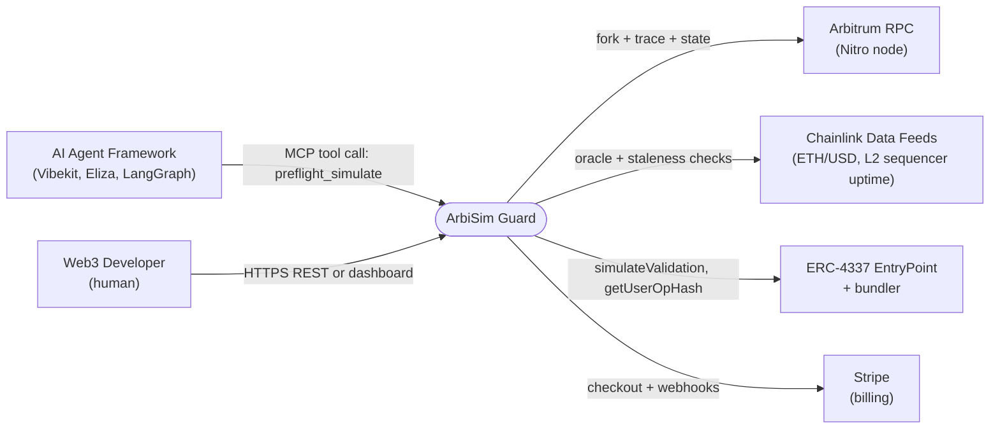
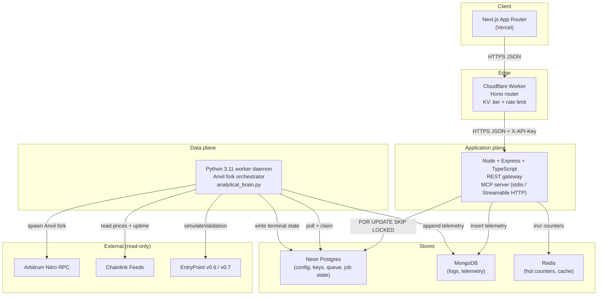
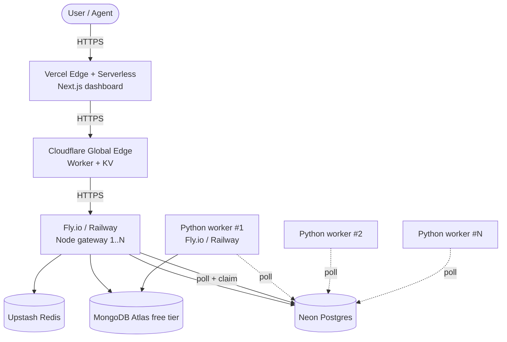

# High-Level Design — ArbiSim Guard

> **One-sentence description:** ArbiSim Guard is the pre-flight simulation layer for AI agents on Arbitrum. It runs transactions and ERC-4337 UserOps inside an ephemeral, block-accurate Anvil fork before they reach mainnet, returning an APPROVED/REJECTED verdict with full gas, slippage, MEV, and Stylus telemetry.

This document is the HLD — Context (C4 L1) and Container (C4 L2) — with deployment topology, trust boundaries, and scaling model. The LLD (Component + sequence) is in [`lld.md`](./lld.md).

---

## 1. System Context (C4 L1)

External actors and the systems ArbiSim depends on. One sentence per arrow.

**External actors**
- **AI Agent Frameworks** (Vibekit, Eliza, LangGraph) — call `preflight_simulate` over MCP stdio (local) or Streamable HTTP (production).
- **Web3 Developer (human)** — uses the Next.js dashboard for the playground, API-key management, and backtesting.
- **Arbitrum RPC** — Nitro node for fork state. ArbiSim never broadcasts to this; it reads.
- **Chainlink Data Feeds** — used for USD P&L and (critically) the L2 Sequencer Uptime Feed.
- **ERC-4337 EntryPoint + bundler** — only for `simulateValidation`. The user's tx is *not* submitted to a bundler from ArbiSim; bundler interaction is read-only off-chain validation.
- **Stripe** — billing for paid tiers.

---

## 2. Container diagram (C4 L2)

Four tiers, each with a technology label and the protocol on every edge.

**Per-edge protocols**
- `FE → CF`: HTTPS, `X-API-Key` header (free tier keys begin `ask_free_…`, pro with `ask_pro_…`).
- `CF → Node`: HTTPS, the same `X-API-Key` is forwarded after KV tier/limit lookup.
- `Node → Neon`: Postgres wire protocol via `pg`; `simulation_queue` and `simulations` tables; `FOR UPDATE SKIP LOCKED` for claim semantics.
- `Node → Mongo`: BSON; `telemetry` collection append-only.
- `Node → Redis`: RESP; counters for usage analytics and idempotency-window cache.
- `Py → Neon`: same Postgres protocol; poll loop.
- `Py → ArbRPC`: JSON-RPC over HTTPS; each fork is its own ephemeral Anvil instance pinned to a block.
- `Py → CL/EP`: JSON-RPC + ABI calls; read-only.

---

## 3. Request lifecycle (summary)

The full sequence diagram is in [`request-lifecycle.md`](./request-lifecycle.md). The 30-second version:

1. `POST /v1/simulations` (or MCP `tools/call preflight_simulate`) → CF edge authn + KV rate-limit check → forwarded to Node.
2. Node validates body, assigns `job_id`, enqueues row in `simulation_queue` (`status='PENDING'`), logs telemetry skeleton, **returns `202 Accepted { job_id, status: "PENDING" }`**.
3. Python worker (`FOR UPDATE SKIP LOCKED` claim) → `status='CLAIMED'` → `status='RUNNING'` → spawns ephemeral Anvil fork of Arbitrum at `block.head - N` → executes the tx/UserOp → runs the analytical engine (`analytical_brain.py`) → writes terminal `APPROVED`/`REJECTED` + telemetry.
4. Client `GET /v1/simulations/{job_id}` polls until `status != PENDING`. Idempotency-Key dedupes repeat submissions.

---

## 4. Deployment topology

**Trust boundaries** (where the API key is validated, where untrusted calldata enters a sandbox):
- API key validated **at the CF edge** (KV lookup) **and** at the Node gateway (defence in depth).
- Untrusted calldata enters **only inside the ephemeral Anvil fork** spawned by the Python worker. The fork is process-isolated, has no mainnet keys, and is torn down after each job.
- The fork's network egress is restricted to the Arbitrum RPC and (for UserOps) the EntryPoint address. No arbitrary outbound HTTP.

---

## 5. Scaling model

| Tier | Knob | Bound |
|---|---|---|
| CF Worker | Concurrent requests | Cloudflare free: 100k req/day. Soft cap ≈ 1 RPS. |
| Node gateway | Stateless horizontally | 1 instance sufficient up to ~50 RPS (Express + JSON). Scale by adding replicas. |
| Python worker | `FOR UPDATE SKIP LOCKED` | Add workers linearly; one queue, no leader election. |
| Anvil fork | Per-job process | Bounded by host RAM. ~2 GB / concurrent fork is realistic; budget accordingly. |
| Neon | Compute + storage | Free tier = 0.25 CU + 0.5 GB. Backtest engine reads many blocks — meter. |

**Why `SKIP LOCKED`**: multiple Python workers contend for jobs on a single queue without coordination. A failed worker's row is reclaimed after a visibility timeout (configurable; default 5 min).

---

## 6. Non-functional targets

| Metric | Target | Notes |
|---|---|---|
| Median time-to-202 | < 200 ms | Node enqueue + Mongo log |
| Median time-to-terminal | < 4 s | Anvil fork spin-up dominates |
| P99 time-to-terminal | < 12 s | Anvil cold start + Arbitrum state restore |
| API availability | 99.5% (free tier) | Pro: 99.9%; Enterprise: 99.95% with SLA |
| Quota (Free) | 500 simulations / month | Hard cap, per-API-key |
| Quota (Pro $29) | 10,000 / month | |
| Quota (Enterprise $299) | 100,000 / month | Webhooks + dedicated support |

---

## 7. What we deliberately don't do (yet)

- **No write-broadcast path.** ArbiSim never submits a tx to mainnet. The agent does, *after* receiving an APPROVED verdict.
- **No multi-chain.** Arbitrum One first; Stylus and Arbitrum Sepolia follow.
- **No persistent mempool / indexer.** Trace analysis is per-job.
- **No on-chain contract.** The "guard" is a software layer over Anvil forks; there is no ArbiSim contract at this stage.

---

## 8. Mathematical Precision & Models

The simulation math is validated against primary Arbitrum and EVM sources with explicit precision flags:

### Arbitrum Nitro 2-D Gas Model
Arbitrum calculates total fee as `L2 base fee × (L2 gas used + L1 calldata buffer)`.
**Precision Flag:** ArbOS uses a non-standard variant of Brotli called **brotli-zero (compression level 0)** — an approximation that is cheap to compute. The compressed size is multiplied by 16 (Ethereum's gas-per-non-zero-byte). ArbiSim Guard mirrors this exactly by compressing the calldata with Brotli level 0 before calculating the buffer, ensuring the pre-flight estimate matches on-chain settlement exactly.

### Stylus WASM Ink & Host I/O
Stylus measures compute in "ink" and charges a penalty when suspending WASM to run native host tasks (Host I/O).
**Precision Flag:** The conversion rate of `1 EVM Gas = 10,000 Ink units` and the `0.84-gas host-I/O penalty` are **configurable, statistically-derived defaults** on Arbitrum, not hardcoded constants. ArbiSim uses these current default configurations but integrators should note they are subject to change by the chain owner. Stylus contracts are detected via the `0xEFF00000` bytecode prefix.
