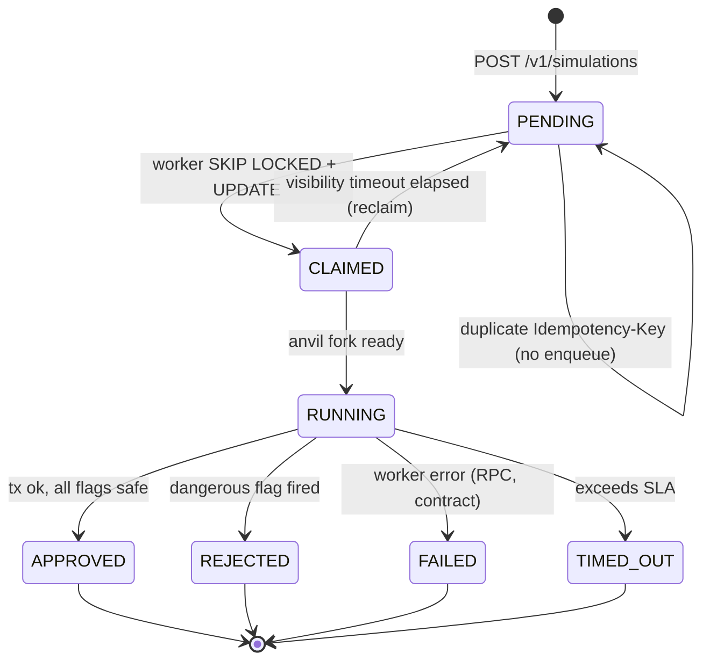

# Low-Level Design — ArbiSim Guard

> Component-level detail: the queue/job state machine, idempotency, rate-limit headers, auth flow, and the data model. Sequence diagrams live in [`request-lifecycle.md`](./request-lifecycle.md).

---

## 1. Data model

### `api_keys` (Neon Postgres)
```sql
CREATE TABLE api_keys (
  id           UUID PRIMARY KEY DEFAULT gen_random_uuid(),
  prefix       TEXT NOT NULL,            -- e.g. "ask_free_a1b2"
  hash         TEXT NOT NULL,            -- argon2id of the full secret
  tier         TEXT NOT NULL CHECK (tier IN ('free', 'pro', 'enterprise')),
  scopes       TEXT[] NOT NULL DEFAULT ARRAY['simulate:read','simulate:write'],
  monthly_quota INTEGER NOT NULL DEFAULT 500,
  owner_email  TEXT,
  created_at   TIMESTAMPTZ NOT NULL DEFAULT now(),
  rotated_at   TIMESTAMPTZ,
  revoked_at   TIMESTAMPTZ
);
CREATE INDEX api_keys_prefix_idx ON api_keys (prefix) WHERE revoked_at IS NULL;
```

**Hot-path mirror**: `(prefix → { tier, monthly_quota, used_this_period })` is mirrored to Cloudflare KV so the edge Worker can decide rate-limit outcomes without a Neon roundtrip. Postgres remains the source of truth and reconciles periodically.

### `simulation_queue` (Neon Postgres)
```sql
CREATE TABLE simulation_queue (
  job_id        UUID PRIMARY KEY DEFAULT gen_random_uuid(),
  api_key_id    UUID NOT NULL REFERENCES api_keys(id),
  network       TEXT NOT NULL,            -- 'arbitrum-one' | 'arbitrum-sepolia' | 'robinhood-chain-testnet'
  agent_address TEXT NOT NULL,
  payload       JSONB NOT NULL,           -- transactions, max_slippage_tolerance
  status        TEXT NOT NULL DEFAULT 'PENDING'
                  CHECK (status IN ('PENDING','CLAIMED','RUNNING','APPROVED','REJECTED','FAILED','TIMED_OUT')),
  worker_id     TEXT,                     -- hostname of the claiming Python worker
  claimed_at    TIMESTAMPTZ,
  started_at    TIMESTAMPTZ,
  finished_at   TIMESTAMPTZ,
  visibility_timeout TIMESTAMPTZ,         -- reclaim deadline
  idempotency_key TEXT,
  created_at    TIMESTAMPTZ NOT NULL DEFAULT now(),
  updated_at    TIMESTAMPTZ NOT NULL DEFAULT now()
);
CREATE INDEX simq_status_vt_idx ON simulation_queue (status, visibility_timeout);
CREATE UNIQUE INDEX simq_idem_uniq ON simulation_queue (api_key_id, idempotency_key)
  WHERE idempotency_key IS NOT NULL;
```

### `telemetry` (MongoDB, append-only)
One document per terminal job. Shape:
```json
{
  "session_id": "uuid",
  "status": "APPROVED" | "REJECTED" | "FAILED" | "TIMED_OUT",
  "gas_cost_eth": "0.00021",
  "stylus_ink_consumed": 0,
  "net_pnl_usd": "-0.42",
  "slippage_detected": false,
  "revert_reason": null,
  "balance_traces": [{ "token": "0x...", "delta": "-1000000" }],
  "token_transfers": [{ "from": "0x...", "to": "0x...", "value": "...", "token": "0x..." }],
  "gas_breakdown": { "l2_gas_used": 185420, "l1_buffer": 12800, "host_io_penalty": 0, "total_wei": "213000000000000" },
  "flags": { "execution_reverted": false, "high_slippage": false, "sandwich_detected": true, "timeboost_recommended": true },
  "created_at": "2026-06-11T..."
}
```

### `backtests` (Neon Postgres, Stage 2)
```sql
CREATE TABLE backtests (
  id            UUID PRIMARY KEY,
  api_key_id    UUID REFERENCES api_keys(id),
  strategy      JSONB NOT NULL,           -- parameterised tx template
  block_start   BIGINT NOT NULL,
  block_end     BIGINT NOT NULL,
  block_stride  INTEGER NOT NULL DEFAULT 100,
  status        TEXT NOT NULL DEFAULT 'PENDING',
  results       JSONB,                   -- equity_curve, sharpe, max_drawdown, win_rate, profit_factor
  ...
);
```

---

## 2. Queue & job state machine



**Reclaim**: a worker that crashes after `CLAIMED` but before writing a terminal status leaves a row stranded. The reclaim job runs every minute: any `CLAIMED`/`RUNNING` row whose `visibility_timeout < now()` is reset to `PENDING` and a new visibility_timeout is set. A `retry_count` column (omitted above for brevity) bounds the loop.

**Critical distinction** (called out in `errors.md`): simulation-result flags like `execution_reverted` or `sandwich_detected` are returned with `200 OK` and `status: REJECTED`. They are **not** HTTP errors. HTTP 4xx/5xx are reserved for *platform* errors (bad key, rate limit, malformed tx, internal failure).

---

## 3. Idempotency

Integrators may retry on network failures. Without dedup, the same transaction could be simulated N times, wasting quota and skewing analytics.

- `Idempotency-Key` is an optional HTTP header on `POST /v1/simulations`.
- Server stores `(api_key_id, idempotency_key, request_hash)` in Redis with a 24-hour TTL.
- On hit, return the original `job_id` and current status (without re-enqueueing).
- Hit on a *different* request body with the same key → `409 Conflict` with RFC 9457 problem `idempotency_key_mismatch`.

> "Idempotency belongs in business logic… Use job IDs. Check if work was already done. Skip if yes, process if no."

---

## 4. Rate limits & headers

| Tier | RPS sustained | Burst | Monthly cap |
|---|---|---|---|
| Free | 1 | 5 | 500 simulations |
| Pro | 10 | 50 | 10,000 |
| Enterprise | 50 | 200 | 100,000 |

**Response headers** (every authenticated call):
- `X-RateLimit-Limit` — monthly cap for the API key
- `X-RateLimit-Remaining` — simulations left in the current period
- `X-RateLimit-Reset` — ISO-8601 timestamp of the next period boundary
- `X-RateLimit-Policy` — `sustained=RPS; burst=N; monthly=M`

**On 429**:
- `Retry-After: <seconds>` (integer, seconds until next slot is available)
- Body is RFC 9457 `application/problem+json`. See [`../errors.md`](../errors.md).

**Recommended client backoff**: exponential with jitter, capped at 30s. Don't hammer.

---

## 5. Auth flow

1. Client sends `X-API-Key: ask_free_a1b2...` (or `ask_pro_…`, `ask_ent_…`).
2. CF Worker extracts the prefix (`ask_free_a1b2`), looks up tier/quota/used in KV.
3. If over quota → `429` with `problem+json`. If unknown prefix → `401`.
4. Worker forwards the full key to Node gateway, which performs the argon2id hash check against `api_keys.hash` (defence in depth).
5. The full key is never logged. Only the prefix is.

**Rotation**: create a new key, deploy it, revoke the old. Both keys remain valid for the overlap window. Revocation sets `revoked_at` and the row is excluded from the prefix index.

---

## 6. Error taxonomy

Adopted from [RFC 9457 — Problem Details for HTTP APIs](https://www.rfc-editor.org/rfc/rfc9457). Full catalog in [`../errors.md`](../errors.md).

```http
HTTP/1.1 429 Too Many Requests
Content-Type: application/problem+json

{
  "type": "https://docs.arbisimguard.com/errors/rate-limited",
  "title": "Monthly quota exceeded",
  "status": 429,
  "detail": "You have used 500 of 500 free-tier simulations this period. Resets 2026-07-01T00:00:00Z.",
  "instance": "/v1/simulations",
  "code": "quota_exceeded",
  "retry_after": 86400
}
```

**Two categories — keep them straight:**

| Category | HTTP status | Examples |
|---|---|---|
| **Platform errors** | 4xx / 5xx | `401 invalid_api_key`, `429 rate_limited`, `400 invalid_payload`, `500 internal_error` |
| **Simulation-result flags** | `200 OK` with `status: REJECTED` | `execution_reverted`, `high_slippage`, `sandwich_detected`, `unsafe_allowance`, `sig_failed`, `valid_until_expired` |

An integrator that treats REJECTED as HTTP failure will break on every bad transaction. Document this loudly.

---

## 7. Sequence diagrams

The most important one — the 202 → poll lifecycle — is in [`request-lifecycle.md`](./request-lifecycle.md).

Other sequences covered there:
- Standard transaction simulation
- ERC-4337 `simulateValidation` path
- MCP `tools/call` path (stdio + Streamable HTTP)
- Error / timeout / reclaim path
