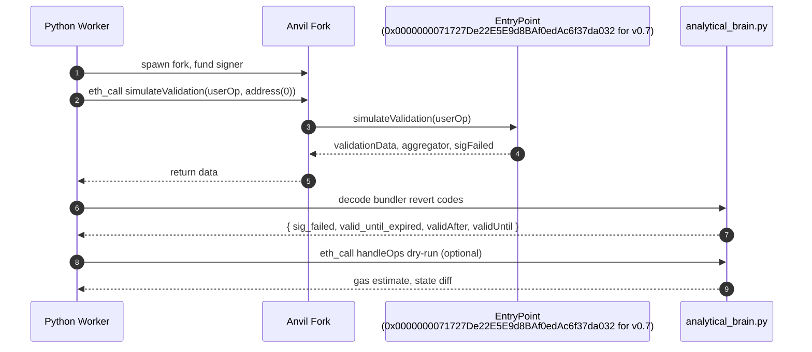
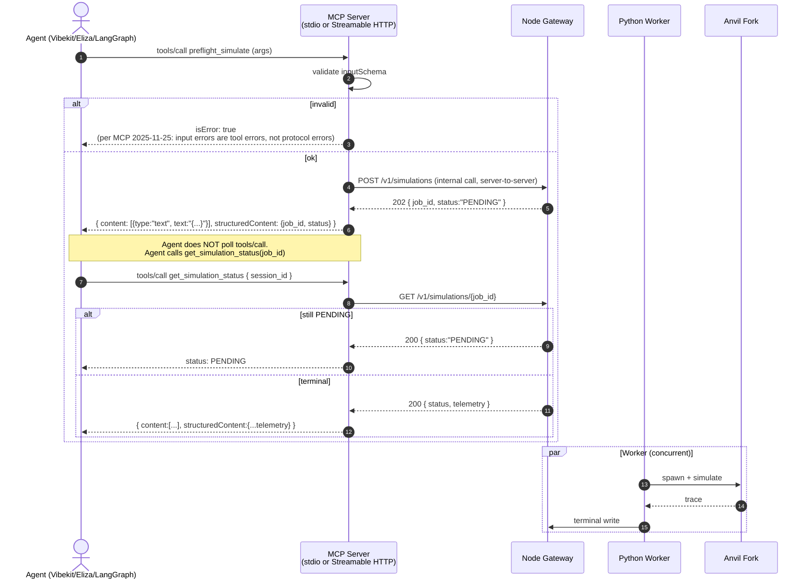
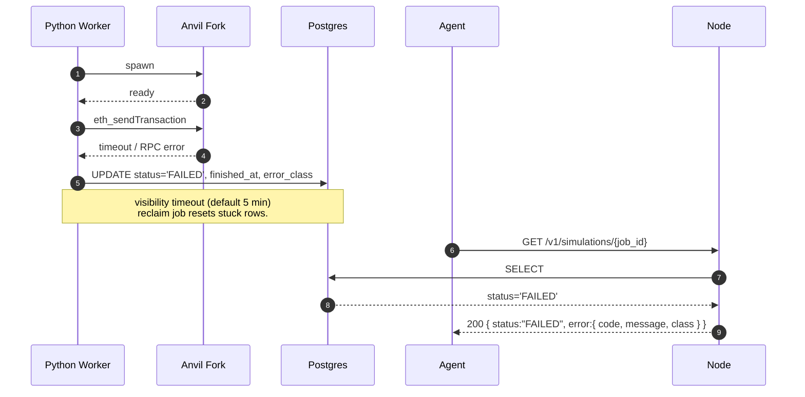
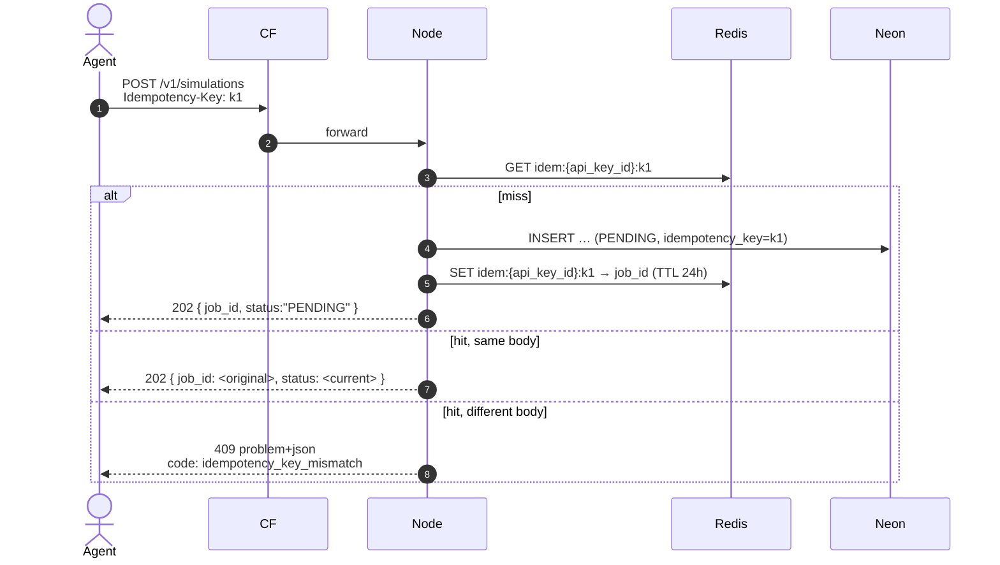

# Request Lifecycle — `POST /v1/simulations`

> The single most important diagram in the system. Read this first.

The simulation pipeline is **asynchronous, queue-based, and idempotent**. Clients receive a `202 Accepted` in <200 ms and poll for the terminal state. This is industry-standard (Stripe webhooks, Tenderly's queued simulations) and required because an Anvil fork spin-up + Arbitrum state restore is 2–8 seconds — far too long to hold an HTTP connection.

---

## 1. Happy path — standard transaction

```mermaid
sequenceDiagram
    autonumber
    actor Agent as AI Agent
    participant CF as Cloudflare Worker
    participant Node as Node Gateway
    participant Neon as Neon Postgres
    participant Py as Python Worker
    participant Anvil as Ephemeral Anvil Fork
    participant Arb as Arbitrum Nitro RPC
    participant Mongo as MongoDB

    Agent->>CF: POST /v1/simulations<br/>X-API-Key: ask_free_…<br/>Idempotency-Key: abc123
    CF->>CF: KV lookup prefix → tier/limit/used
    alt over quota
        CF-->>Agent: 429 problem+json<br/>Retry-After
    else ok
        CF->>Node: forward (HTTPS, full key)
        Node->>Node: validate body (JSON schema)
        Node->>Neon: BEGIN; INSERT simulation_queue<br/>(PENDING, idempotency_key=abc123); COMMIT
        Node->>Mongo: insert telemetry skeleton
        Node-->>CF: 202 { job_id, status:"PENDING" }
        CF-->>Agent: 202 { job_id, status:"PENDING" }

        loop poll (default 2s interval, jittered)
            Agent->>CF: GET /v1/simulations/{job_id}
            CF->>Node: forward
            Node->>Neon: SELECT status FROM simulations WHERE job_id=$1
            alt PENDING
                Node-->>Agent: 200 { status:"PENDING" }
            else terminal
                Node->>Mongo: load telemetry
                Node-->>Agent: 200 { status:"APPROVED"|"REJECTED", telemetry: {...} }
            end
        end

        par Worker claim
            Py->>Neon: SELECT … FOR UPDATE SKIP LOCKED LIMIT 1
            Neon-->>Py: row (job_id, payload, agent_address)
            Py->>Neon: UPDATE … SET status='CLAIMED', worker_id, claimed_at, visibility_timeout
            Py->>Anvil: spawn fork at block.head-1
            Anvil->>Arb: eth_getBlockByNumber, state snapshots
            Arb-->>Anvil: state
            Py->>Neon: UPDATE status='RUNNING'
            Py->>Anvil: eth_sendTransaction (call only)
            Anvil-->>Py: trace, logs, gasUsed, status
            Py->>Py: analytical_brain.analyse(trace, logs)
            Py->>Mongo: append terminal telemetry
            Py->>Neon: UPDATE status='APPROVED'|'REJECTED', finished_at
            Py->>Anvil: kill process, drop temp dir
        end
    end
```

---

## 2. ERC-4337 UserOp path

The pipeline is identical up to the fork step. The difference is the analytical engine:

1. **Decode** the `UserOperation` (v0.6 or v0.7).
2. **Call** `EntryPoint.simulateValidation(userOp)` on the fork.
3. **Mirror** the bundler revert codes: `AA22 expired or not due`, `AA24 signature error` (v0.6); `AA32 expired or not due`, `AA34 signature error` (v0.7). v0.7 moved the time-range intersection off-chain; simulation returns raw `validationData`.
4. **If `simulateValidation` returns `validationData` with `validAfter ≤ block.timestamp ≤ validUntil`** → flag `valid_until_expired` if *not* in window.
5. **If signature check failed** → flag `sig_failed`.



---

## 3. MCP `tools/call` path

The MCP server in `gateway/src/index.ts` is a thin shim over the REST surface. Tools map 1:1:

| MCP tool | REST equivalent |
|---|---|
| `preflight_simulate` | `POST /v1/simulations` |
| `get_simulation_status` | `GET /v1/simulations/{job_id}` |



> **Important MCP behaviour**: input-validation errors are returned as `isError: true` (tool execution errors), **not** as `McpError` / protocol errors. This is the 2025-11-25 revision of the spec.

---

## 4. Error / timeout / reclaim path



**Reclaim cron** (Node gateway, every 60 s):
```sql
UPDATE simulation_queue
SET status='PENDING', visibility_timeout=now() + interval '5 minutes'
WHERE status IN ('CLAIMED','RUNNING') AND visibility_timeout < now()
RETURNING job_id;
```
Reclaimed rows get a `retry_count` increment. After 3 reclaims, the row is marked `FAILED` permanently with `error_class='max_retries_exceeded'`.

---

## 5. Idempotency replay


